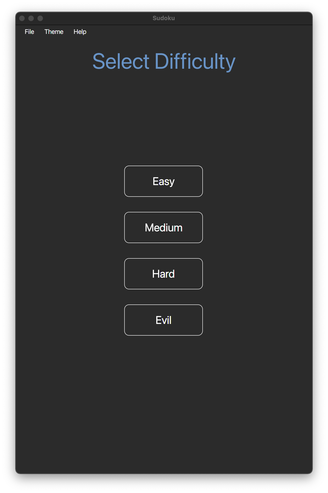
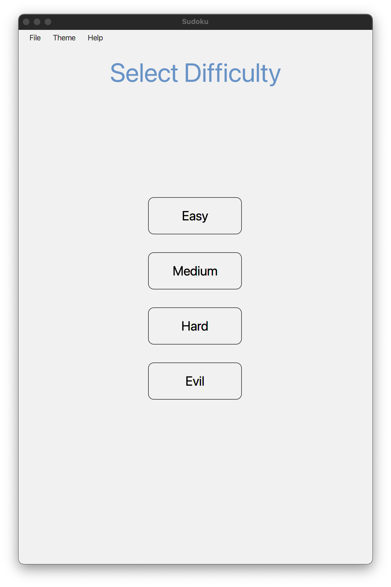

# Sudoku

A modern desktop application of the classic Sudoku game.

## Table of contents

* [General info](#general-info)
* [Screenshots](#screenshots)
* [Features](#features)
* [Setup](#setup)
    * [Prerequisites](prerequisites)
    * [Installation](installation)
* [Contact](#contact)

## General info

Add more general information about project. What the purpose of the project is? Motivation?

## Screenshots

Home - Dark | Home - Light
:------------ :|:----------------:
 | 
Difficulty - Dark | Difficulty - Light
 | 

## Setup

## Contact

Amir Elrahep - [LinkedIn](https://www.linkedin.com/in/amir-elrahep-4141a1154/)
